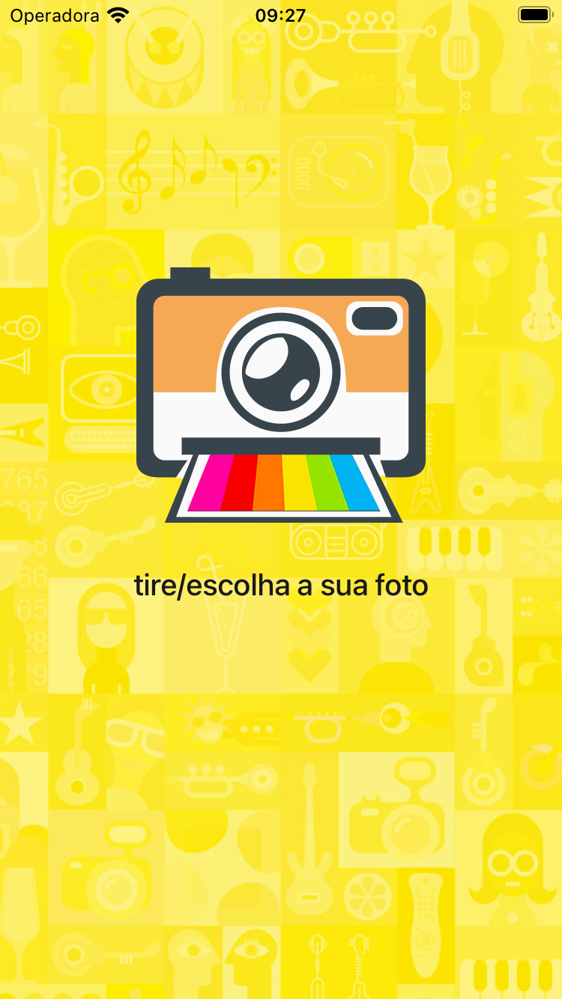
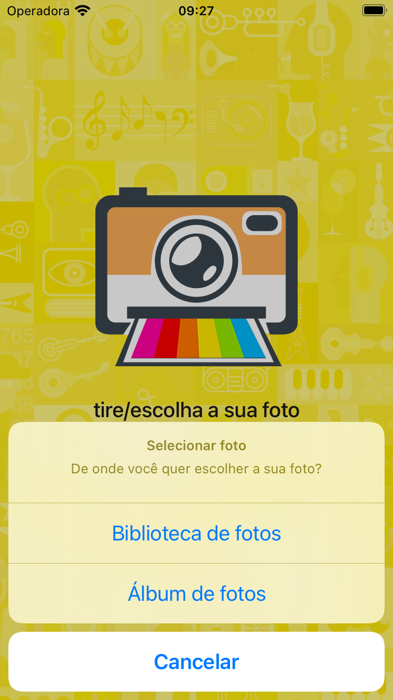
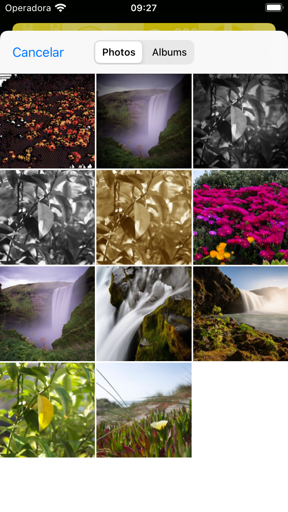
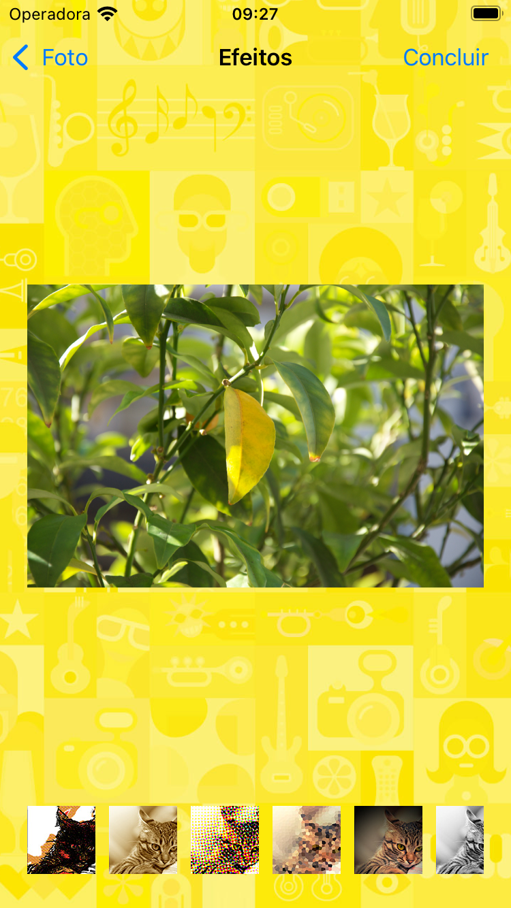
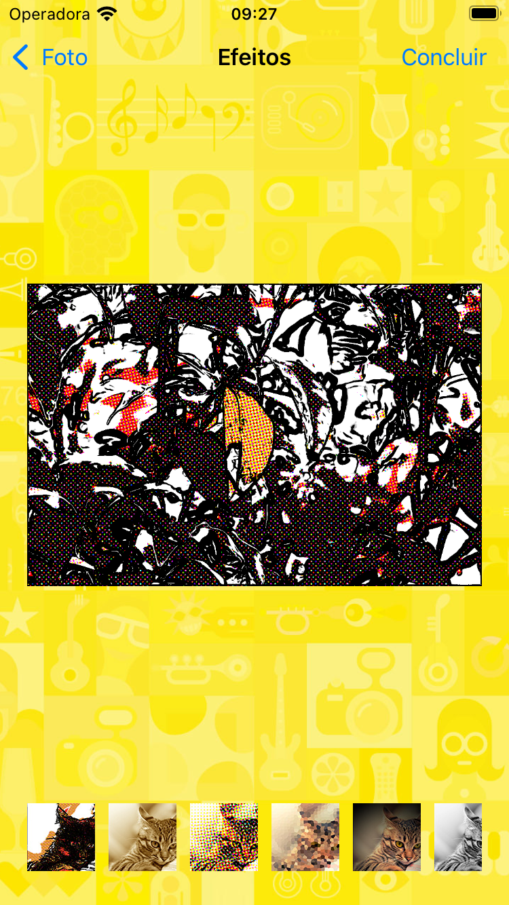
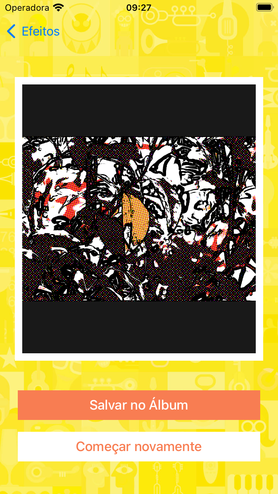

# Fotoroid
> Aplicativo para desenvolvimento Swift/iOS

* Linguagem
    * Swift 5.5
    * MVC
    
* Auto Layout
    * Autoresizing
    * Constraint
    * Assets
    
* Components
    * UIView
    * UILabel
    * UIImage
    * Segue
    * UIButton
    * UIImagePickerController
    * UINavigationController
    * UIBarButtonItem
    * UINavigationItem
    * UICollectionView
    * UIActivityIndicatorView
    * CoreImage
    * Threads
       * Toda alteração gráfica que for solicitada deve ser realizada dentro da main thread, obrigatoriamente.

    
## Snapshots

  
 

 
  

  
 

 
  

  
 

  
 
